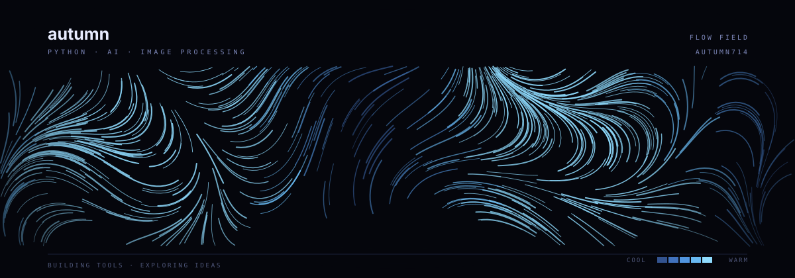

  

Python과 AI로 유용한 도구를 만들고, 배운 내용을 기록합니다.

### projects

- **[Translator](https://github.com/autumn714/translator)** — FastAPI와 vLLM 기반 다국어 번역 앱. 입력 후 자동 번역과 용어집을 지원합니다.
- **[Image Project](https://github.com/autumn714/Image-Project)** — Python·OpenCV로 구현한 간단한 이미지 편집 프로그램.

### learning

[AI · ML · Statistics](https://github.com/autumn714/AI) · [Data Structures · Algorithms](https://github.com/autumn714/Algorithm)

---

[모든 저장소 보기](https://github.com/autumn714?tab=repositories)
