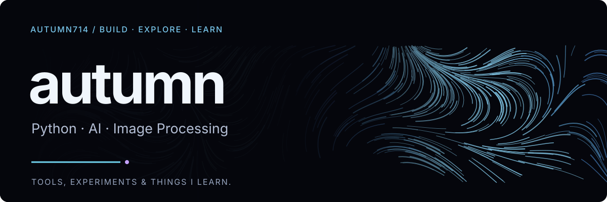
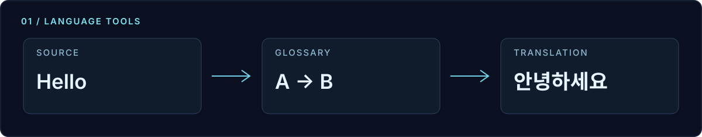
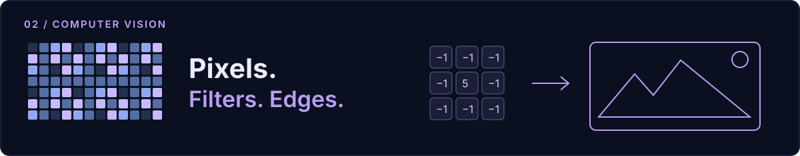

  <b>Python과 AI로 유용한 도구를 만들고, 배운 내용을 기록합니다.</b> 
  번역 도구부터 이미지 처리, 알고리즘과 모델 구현까지.

  <a href="#projects">Projects</a> &nbsp; · &nbsp;
  <a href="#stack">Stack</a> &nbsp; · &nbsp;
  <a href="#learning">Learning</a> &nbsp; · &nbsp;
  <a href="https://github.com/autumn714?tab=repositories">All repositories ↗</a>

## Projects

### 01 &nbsp; Translator

**입력을 멈추면 번역이 시작되는 다국어 번역 앱.**

원문과 번역을 나란히 비교하고, 사용자 용어집으로 반복되는 표현을 관리합니다. 긴 입력은 나누어 처리하며, 새로운 입력이 들어오면 이전 요청을 취소합니다.

`Python` `FastAPI` `vLLM` `Docker Compose`

**[코드 보기 ↗](https://github.com/autumn714/translator)** &nbsp; · &nbsp; [기능·실행 안내](https://github.com/autumn714/translator#readme)

 

### 02 &nbsp; Image Project

**선택한 영역에 필터를 적용하는 이미지 처리 프로그램.**

마우스로 이미지 영역을 선택하고 블러·샤프닝을 적용합니다. Prewitt, Sobel, Laplacian 필터로 이미지의 윤곽선을 탐색합니다.

`Python` `OpenCV` `NumPy`

**[코드 보기 ↗](https://github.com/autumn714/Image-Project)** &nbsp; · &nbsp; [프로젝트 안내](https://github.com/autumn714/Image-Project#readme)

 

### 03 &nbsp; 공모함

공모전 수집·중복 정리·참여 상태 관리를 위한 웹 앱의 배포 저장소입니다.

**[웹에서 열기 ↗](https://autumn714.github.io/gongmoham-web/)** (이메일 로그인 필요) &nbsp; · &nbsp; [배포 저장소](https://github.com/autumn714/gongmoham-web)

## Stack

  
  
  
  
  
  

번역 서비스에는 **FastAPI · vLLM · Docker Compose**, 이미지 처리에는 **OpenCV · NumPy**를 사용했습니다.

## Learning

### 모델을 직접 구현하며

[**AI ↗**](https://github.com/autumn714/AI) — 은닉 마르코프 모델과 정보 이론을 Python으로 구현한 학습 기록입니다.

`Hidden Markov Model` `Entropy` `Python`

### 문제를 풀고 정리하며

[**Algorithm ↗**](https://github.com/autumn714/Algorithm) — 백준 문제 풀이와 자료구조·알고리즘 학습 기록을 모았습니다.

`Problem Solving` `Data Structures` `Algorithms`

---

  <b>Build. Explore. Learn.</b> 
  <a href="https://github.com/autumn714?tab=repositories">저장소 둘러보기 ↗</a>

