# Hi there, I'm arima! 

### AI Engineer · Data Analyst

  <a href="#about-me">About Me</a> ·
  <a href="#tech-stack">Tech Stack</a> ·
  <a href="#github-stats">GitHub Stats</a> ·
  <a href="#selected-projects">Projects</a>

### About Me

- 🤖 **AI Engineer · Data Analyst**
- 🛠 I build useful tools with **Python and AI**.
- 🌐 My projects include a **multilingual translator** and a competition tracking web app.
- 🖼 I explore **image processing with OpenCV**.
- 📚 I learn by implementing models and solving algorithm problems.

 

---

### Tech Stack

<!-- STACK:START -->
#### Languages

  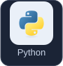
  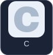
  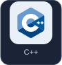
  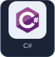
  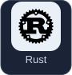

#### Data Analysis

  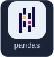
  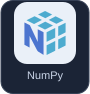
  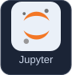
  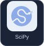
  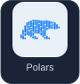

#### Machine Learning

  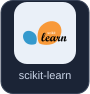
  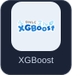
  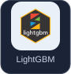
  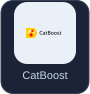
  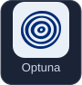

#### Deep Learning & Computer Vision

  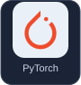
  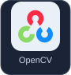
  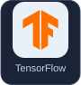
  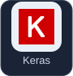
  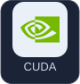

#### LLM & Generative AI

  
  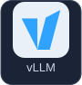
  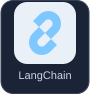
  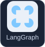
  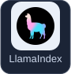
  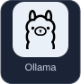
  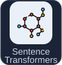

#### Vector Search & RAG

  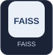
  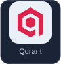
  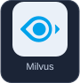

#### Visualization

  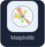
  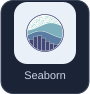
  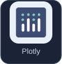
  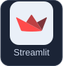

#### Databases & Warehouses

  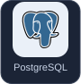
  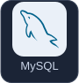
  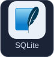
  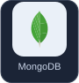
  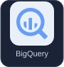
  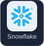

#### Data Pipelines

  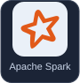
  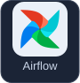
  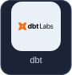
  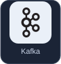

#### Development, Deployment & Operations

  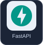
  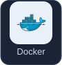
  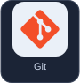
  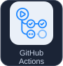
  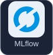
  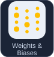
  
  
  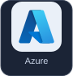
  
  

<!-- STACK:END -->

---

### GitHub Stats

  <picture>
    <source media="(prefers-color-scheme: dark)" srcset="./assets/streak-dark.svg" />
    <source media="(prefers-color-scheme: light)" srcset="./assets/streak-light.svg" />
    
  </picture>

---

### Selected Projects

- 🌐 **[Translator](https://github.com/autumn714/translator)** — `Python` `FastAPI` `vLLM` 
  입력 후 자동 번역, 원문·번역 대조, 사용자 용어집을 지원합니다.
- 🖼 **[Image Project](https://github.com/autumn714/Image-Project)** — `Python` `OpenCV` `NumPy` 
  선택한 이미지 영역에 블러·샤프닝·윤곽선 필터를 적용합니다.
- 🗂 **[공모함](https://autumn714.github.io/gongmoham-web/)** — [웹 배포 저장소](https://github.com/autumn714/gongmoham-web) 
  공모전 수집·중복 정리·참여 상태를 관리합니다. 이메일 로그인이 필요합니다.

📚 **Learning notes:** [AI & Information Theory](https://github.com/autumn714/AI) · [Algorithms](https://github.com/autumn714/Algorithm)

  <a href="https://github.com/autumn714?tab=repositories">Explore all repositories ↗</a>

