# Hi there, I'm arima! 

### AI Engineer · Data Analyst

<p>
  <a href="#about-me">About Me</a> ·
  <a href="#tech-stack">Tech Stack</a> ·
  <a href="#github-stats">GitHub Stats</a> ·
  <a href="#selected-projects">Projects</a>
</p>


### About Me

- 🤖 **AI Engineer · Data Analyst**
- 🛠 I build useful tools with **Python and AI**.
- 🌐 My projects include a **multilingual translator** and a competition tracking web app.
- 🖼 I explore **image processing with OpenCV**.
- 📚 I learn by implementing models and solving algorithm problems.

<br clear="both" />

---

### Tech Stack

<!-- STACK:START -->
#### Languages

<p>
  
  
  
  
  
</p>

#### Data Analysis

<p>
  
  
  
  
  
</p>

#### Machine Learning

<p>
  
  
  
  
  
</p>

#### Deep Learning & Computer Vision

<p>
  
  
  
  
  
</p>

#### LLM & Generative AI

<p>
  
  
  
  
  
  
  
</p>

#### Vector Search & RAG

<p>
  
  
  
</p>

#### Visualization

<p>
  
  
  
  
</p>

#### Databases & Warehouses

<p>
  
  
  
  
  
  
</p>

#### Data Pipelines

<p>
  
  
  
  
</p>

#### Development, Deployment & Operations

<p>
  
  
  
  
  
  
  
  
  
  
  
</p>

<!-- STACK:END -->

---

### GitHub Stats

<p align="center">
  
</p>

<!-- COMMIT_ACTIVITY:START -->
**🕒 Commits by Time of Day**

```text
Morning        0 commits  ░░░░░░░░░░░░░░░░░░░░░░░░░   0.00 %
Daytime        1 commits  ██░░░░░░░░░░░░░░░░░░░░░░░   8.33 %
Evening        3 commits  ██████░░░░░░░░░░░░░░░░░░░  25.00 %
Night          8 commits  █████████████████░░░░░░░░  66.67 %
```

**📅 Commits by Day of Week**

```text
Monday         3 commits  ██████░░░░░░░░░░░░░░░░░░░  25.00 %
Tuesday        9 commits  ███████████████████░░░░░░  75.00 %
Wednesday      0 commits  ░░░░░░░░░░░░░░░░░░░░░░░░░   0.00 %
Thursday       0 commits  ░░░░░░░░░░░░░░░░░░░░░░░░░   0.00 %
Friday         0 commits  ░░░░░░░░░░░░░░░░░░░░░░░░░   0.00 %
Saturday       0 commits  ░░░░░░░░░░░░░░░░░░░░░░░░░   0.00 %
Sunday         0 commits  ░░░░░░░░░░░░░░░░░░░░░░░░░   0.00 %
```

<sub>Public commits · KST (UTC+9) · 12 commits · Updated 2026-09-29</sub>

<details>
<summary>집계 기준</summary>

- 본인 소유 공개 저장소의 기본 브랜치에서 autumn714 작성자로 조회되는 커밋을 집계합니다.
- 커밋 작성 시각을 한국 시간으로 변환하며, 같은 SHA는 한 번만 셉니다.
- Morning 06–12시 · Daytime 12–18시 · Evening 18–24시 · Night 00–06시입니다.
- 위 Streak 카드에는 다른 저장소의 활동 등도 포함될 수 있어 두 통계의 총합은 다를 수 있습니다.

</details>
<!-- COMMIT_ACTIVITY:END -->

---

### Selected Projects

- 🌐 **[Translator](https://github.com/autumn714/translator)** — `Python` `FastAPI` `vLLM`<br />
  입력 후 자동 번역, 원문·번역 대조, 사용자 용어집을 지원합니다.
- 🖼 **[Image Project](https://github.com/autumn714/Image-Project)** — `Python` `OpenCV` `NumPy`<br />
  선택한 이미지 영역에 블러·샤프닝·윤곽선 필터를 적용합니다.
- 🗂 **[공모함](https://autumn714.github.io/gongmoham-web/)** — [웹 배포 저장소](https://github.com/autumn714/gongmoham-web)<br />
  공모전 수집·중복 정리·참여 상태를 관리합니다. 이메일 로그인이 필요합니다.

📚 **Learning notes:** [AI & Information Theory](https://github.com/autumn714/AI) · [Algorithms](https://github.com/autumn714/Algorithm)

---

<!-- WISDOM:START -->
### 📜 오늘의 사자성어


### 🌿 오늘의 한국 속담


<sub>한국 시간 기준 매일 새로운 한마디 · 2026-09-29</sub>
<!-- WISDOM:END -->

<p align="center">
  <a href="https://github.com/autumn714?tab=repositories">Explore all repositories ↗</a>
</p>
